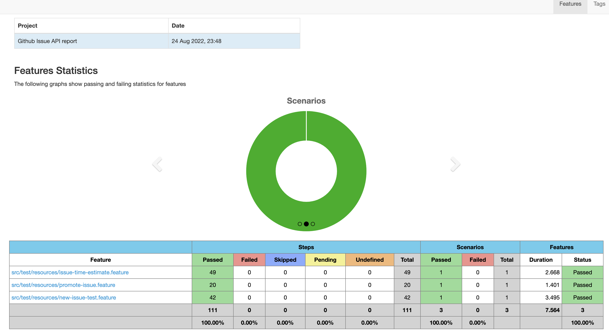

# API testing using karate
[Karate](https://github.com/intuit/karate) is an open-source API test automation tool. API tests are written using Behaviour Driven Development (BDD) Gherkin syntax

[Karate-Gatling](https://github.com/intuit/karate/tree/master/karate-gatling) is an open-source API performance testing tool

- Added test cases to validate CRUD of new issue.
- Added test cases to verify time estimate functionality of new issue.
- Added tests for promote issue functionality.
- Added scala file for load testing of new issue endpoints. 
- There is option to run tests via Docker.
- Added github CI pipeline.

## Project Setup
- Install [Java 8](https://www.oracle.com/technetwork/java/javase/downloads/jdk8-downloads-2133151.html)

- Install [Maven](https://maven.apache.org/install.html)


## Execute Scripts

#### command to run API testing

```
mvn clean test -Dtest=KarateJunit
```

#### command to run specific feature file for API testing

For example, to run validateUsers feature file with tag "users"

```
mvn clean test -Dtest=KarateJunit -Dcucumber.options="--tags @newIssue" -DargLine='-Dkarate.env=Test'
```

### performance testing command

```
mvn clean test-compile gatling:test -Dgatling.simulationClass=performance.LoadTestingSimulation -Dkarate.env=Test
```

### performance test report

folder target -> gatling -> index.html

### karate test report

folder target -> cucumber-html-reports -> overview-features.html




### Build docker image

```
docker build -t api:1 .
```

#### Run docker image
```
docker run -it --rm --name api api:1
```
